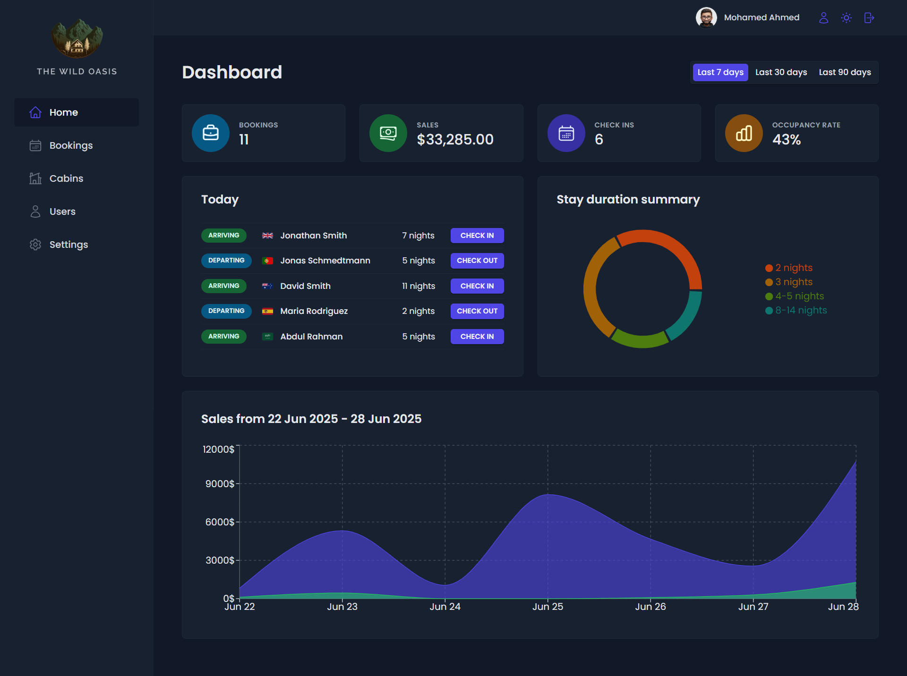
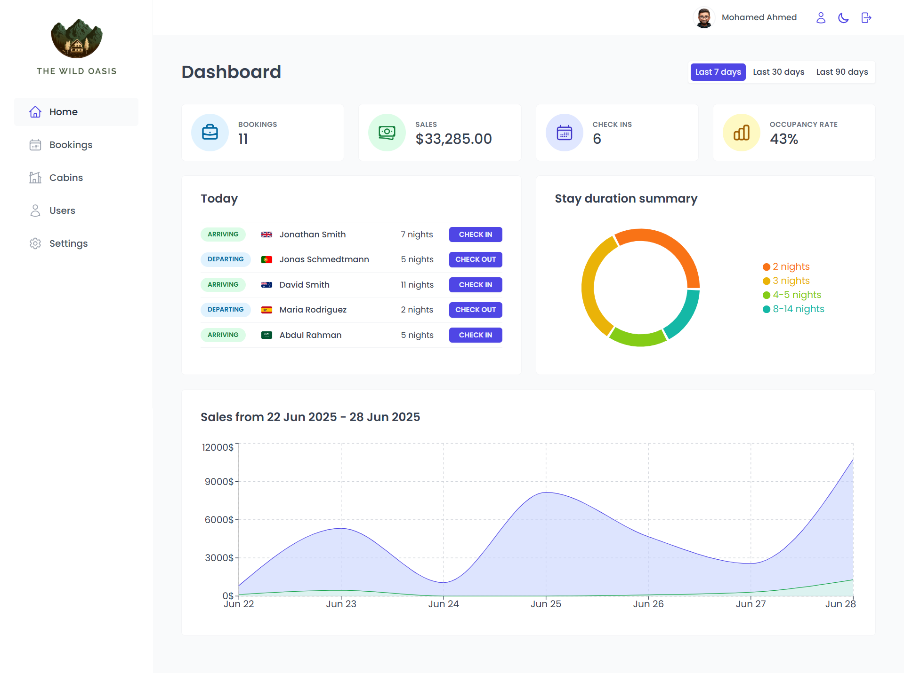

# Hotel Booking Management System

A back-office hotel booking management system built with React and Supabase. This system is designed for hotel staff to easily manage rooms, bookings, and system settings with a clean, modern interface.

## 📸 Screenshots





## 🚀 Features

- **Room Management**  
  - Add, edit, and delete rooms  
  - Duplicate room data to quickly add similar rooms  
  - Define room price, number of guests, room number, description, discount, and upload photos

- **Booking Management**  
  - Confirm bookings  
  - Check-in and check-out functionality  
  - View and manage booking details  
  - Cancel bookings  
  - Professional filters to search and sort bookings and rooms

- **System Settings**  
  - Configure system-wide settings, such as:
    - Minimum nights per booking
    - Maximum nights per booking
    - Maximum guests per booking
    - Breakfast price

- **User Management**  
  - Add new system users (only by current authorized users)
  - Update current user profile (name, avatar, password)
  - Login page for user authentication

- **Dashboard**  
  - View hotel statistics and insights with charts and reports

- **Other Features**  
  - Supports Dark Mode  
  - Feature-based folder architecture for better scalability  
  - Modern UX/UI

## 🛠 Tech Stack

- React 18 + Vite
- React Router DOM
- React Query
- React Hook Form
- React Hot Toast
- React Icons
- Styled Components
- Recharts
- Backend: Supabase

## 🗂 Project Structure

```
the-wild-oasis/
├── docs/
├── public/
├── src/
│ ├── context/
│ ├── features/
│ │ ├── authentication/
│ │ ├── bookings/
│ │ ├── cabins/
│ │ ├── check-in-out/
│ │ ├── dashboard/
│ │ └── settings/
│ ├── hooks/
│ ├── pages/
│ ├── services/
│ ├── styles/
│ ├── ui/
│ ├── utils/
│ ├── App.jsx
│ ├── main.jsx
│ └── index.css
├── .gitignore
├── index.html
├── package.json
├── README.md
├── vite.config.js
└── ...
```

## ⚙️ Installation

1. **Clone the repository**

   ```bash
   git clone https://github.com/MohamedAhIsmail/The-Wild-Oasis-Hotel-Management.git

2. **Install dependencies**
   
   ```bash
   npm install
   
3. **Run the app**
   
   ```bash
   npm run dev
